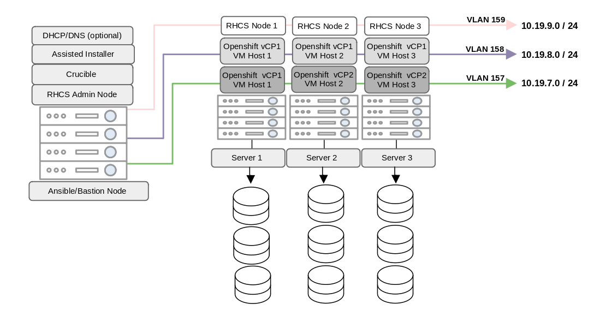
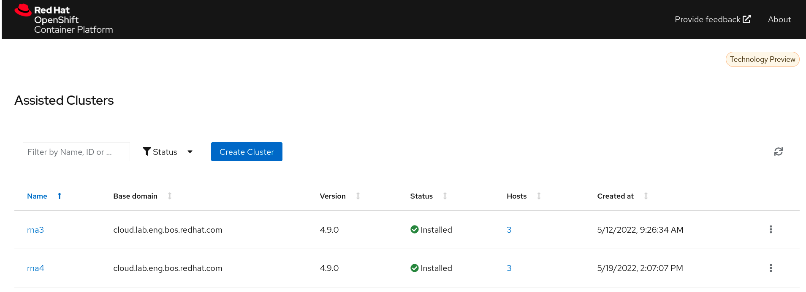
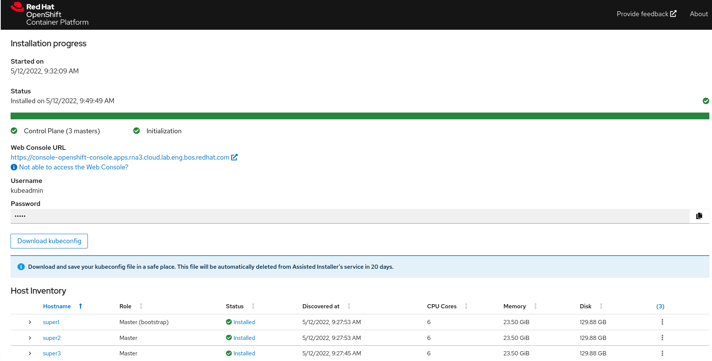
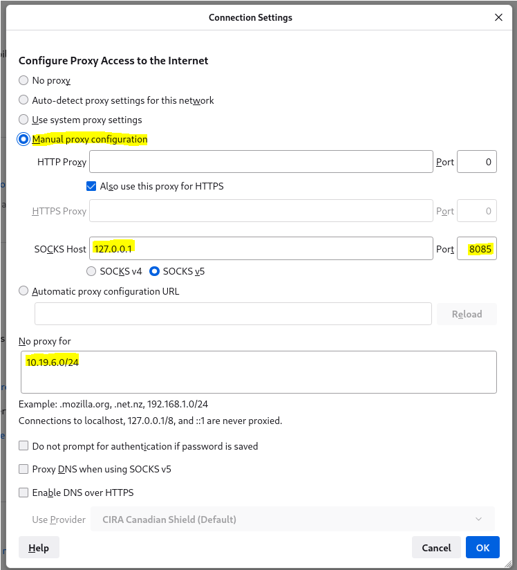
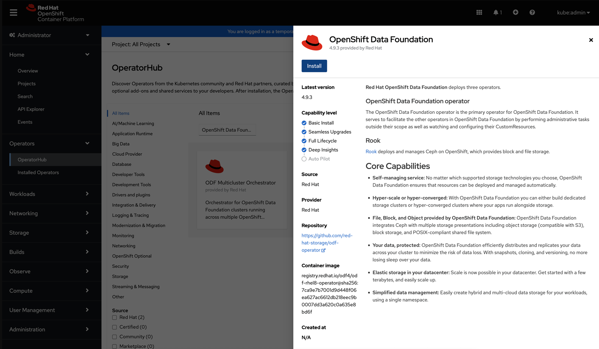
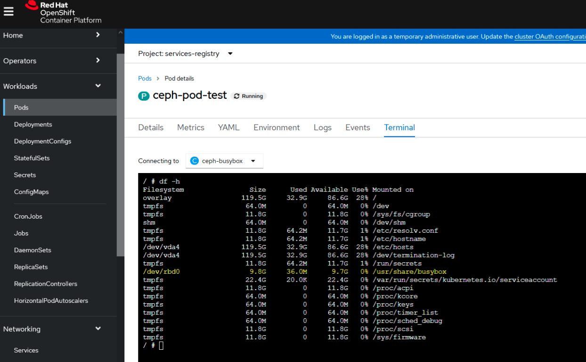
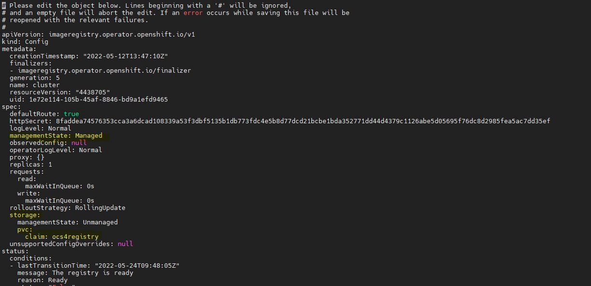
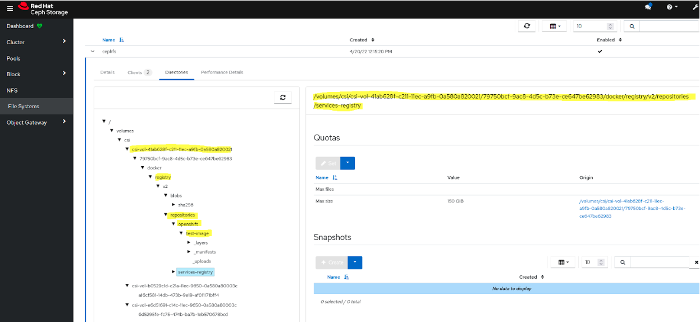

# Deploying RHCS using minimum hardware and making it work for multiple OCP clusters via ODF

Having a software defined storage fabric such as Red Hat Ceph Storage (RHCS) is advantageous to provide file, block and object storage services for workloads deployed on top of Openshift. In many cases Openshift clusters are required to have a storage solution in place that is highly available for multiple clusters to leverage and which can be easily deployed using a minimum hardware footprint. The approach described below can help use the hardware resources efficiently.

This blog post highlights how using RHCS in External Mode and Openshift Data Fabric (ODF) together can achieve the desired flexibility for our storage needs which are required by multiple clusters running on distinct physical servers. We will demonstrate this by deploying multiple Openshift clusters and RHCS on top of 3 physical distinct servers with available NVMe drives. To fully achieve this we will make use of the Crucible automation project (which is a set of ansible playbooks used to deploy a Openshift cluster and all its prerequisites), RHCS 5 and ODF 4.9.6. The goal for this article is to underline all important steps required to set up a minimum hardware environment for RHCS and ODF to work together.

# Setting up the Lab Environment
In order to run trails on a minimum hardware footprint, the lab environment is set up on top of 4 bare metal server nodes. One of the nodes will be the bastion/ansible host node that will be used to set up the OCP and RHCS clusters on the other remaining 3 bare metal nodes.

Using the crucible automation (which is mentioned later in the documentation), RHEL KVM will be deployed on 3 bare metal server nodes and for both OCP clusters, and separate individual VMs will be created on top of each bare metal node. Separate VLANs and networks will be created for both the OCP clusters and the RHCS cluster. The BM hardware specification as well the VM hardware specification are listed below.

The RHCS cluster will also be deployed on top of the 3 BM nodes using the installation guide that this documentation covers. Similar to the OCP clusters, the RHCS cluster will also be deployed on a separate VLAN and network in order to ensure and validate that the RHCS cluster can run in “external mode” efficiently. Each of the BM nodes consist of 3 x NVMe free drives as mentioned in the hardware specification and those will be leveraged inside our RHCS cluster, so in total we will have 9 OSDs configured.



# Openshift Clusters Installation & Setup using Crucible Automation

## Crucible Automation ##

Crucible automation is a set of playbooks for installing an OpenShift Container Platform cluster on premise using the developer preview version of the OpenShift Assisted Installer.  The key benefits of using crucible automation for our lab environment is it allows us to deploy base Red Hat Openshift 4.9 control planes for both clusters in separate virtual machines across our three physical servers. 

For our particular deployment we need to ensure complete segregation of networks and using crucible this can be automated and all the prerequisites for both Openshift Clusters (DNS/DHCP/Bridging/VLANS) are set up with ease.
Clone crucible repository using the commands below:

```console
$ git clone https://github.com/redhat-partner-solutions/crucible-public
```
In order to use these playbooks to deploy OpenShift, the availability of a jump/bastion host (which can be virtual or physical) and a minimum of three target systems for the resulting cluster (which can be either virtual or physical) is required.  These playbooks are intended to be run from the jump/bastion host that itself is subscribed to Red Hat Subscription Manager.
For this lab based deployment guide we will try to create 2 clusters, the playbook can be ran on separate inventory files to deploy OpenShift’s control plane as 1 Virtual Machines per baremetal nodes and 3 nodes in total.

Each virtual machine for Control Plane nodes of Openshift cluster should have at least following specifications:
- vCPU: 6
- Memory: 24GB
- Disk: 120gb

**Note:** Make sure that firewall **“masquerade”** is **“yes”** because after the installation of Ceph this turns into **“no”**. If this stays in **“no”**, Crucible installation fails. 

You can check this configuration in Bastion host with following command:

```console
$ firewall-cmd --list-all
public (active)
  target: default
  icmp-block-inversion: no
  interfaces: ceph.159 cni-podman0 eno2 rna3.158 rna4.157
  sources:
  services: ceph ceph-mon cockpit dhcpv6-client ntp ssh
  ports: 80/tcp 8000/tcp 8090/tcp 8080/tcp 53/udp 67/udp 8888/tcp 9283/tcp 8443/tcp 9093/tcp 9094/tcp 3000/tcp 9095/tcp 9100/tcp
  protocols:
  forward: no
  masquerade: yes
  forward-ports:
  source-ports:
  icmp-blocks:
  rich rules:
```

If it is not **“yes”**, you can enable it with following command:

```console
$ firewall-cmd --zone=public --add-masquerade
```
## Installation Steps ##

Crucible Inventory files of our 2 OCP  clusters can be retrieved here:


When inventory files for our cluster is ready, we can start the crucible deployment with following:
```console
$ ansible-playbook -i vCP2inventory.yml site.yml -vv
```
When deployment finishes, we can see the GUI address, password, kubeconfig file in our assisted installer GUI. It is possible to reach Assisted Installer GUI from **http://<bastion_IP>:8080/clusters**



If you click on one of the clusters, you can see the details about that cluster.



## Connecting to Openshift GUI ##

As we have deployed our Openshift clusters on separate tagged VLANs, we need to enable SSH tunnel and proxy settings on our browser. 
First we need to create the SSH tunnel to our bastion host. We can create the SSH tunnel using this command:

```console
$ ssh -f -N -D 8085 root@10.19.6.21
```
Every time we want to connect to GUI we have to make sure that this tunnel is active.
To configure the proxy settings in our browser, In Firefox, we configure our proxy settings from this menu.




Lastly, we need to configure local configuration to resolve the hostnames. Add the following entries in your /etc/hosts file:
```
10.19.8.1	api.rna3.cloud.lab.eng.bos.redhat.com
10.19.8.3	oauth-openshift.apps.rna3.cloud.lab.eng.bos.redhat.com
10.19.8.3	console-openshift-console.apps.rna3.cloud.lab.eng.bos.redhat.com
10.19.8.3	grafana-openshift-monitoring.apps.rna3.cloud.lab.eng.bos.redhat.com
10.19.8.3	thanos-querier-openshift-monitoring.apps.rna3.cloud.lab.eng.bos.redhat.com
10.19.8.3	prometheus-k8s-openshift-monitoring.apps.rna3.cloud.lab.eng.bos.redhat.com
10.19.8.3	alertmanager-main-openshift-monitoring.apps.rna3.cloud.lab.eng.bos.redhat.com
```
## Connecting to Openshift CLI ##
In order to connect to Openshift CLI we need to ensure that we have the kubeconfigs for both clusters present on our bastion host.

Using the post-install playbook from crucible one can generate these kubeconfigs using the commands below (Please note that the cluster_id must be changed for specific clusters accordingly):
```console
$ ansible-playbook -i vCP2inventory.yml post_install.yml -e cluster_id=4b4b8007-6e5a-45c6-bd7a-8a2f9b32c87b
```
Once the kubeconfig is available on the bastian host we can export the exact location of it to a variable KUBECONFIG
```console
$ export KUBECONFIG=/home/redhat/rna3-kubeconfig
```

# Red Hat Ceph Storage 5 Installation & Setup

Red Hat Ceph Storage 5 is chosen as the storage platform of choice for this lab installation. We will use the cephadm utility to deploy new Red Hat Ceph Storage clusters. It manages the entire life cycle of a RHCS cluster. 

Installation and management tasks comprise of two main operations. 

**Day One operations** will involve installing and bootstrapping a bare-minimum, containerized Ceph storage cluster, running on a single node. Day One also includes deploying the Monitor and Manager daemons and adding Ceph OSDs.

**Day Two operations** use the Ceph orchestration interface, cephadm orch, or the Red Hat Ceph Storage Dashboard to expand the storage cluster by adding other RHCS services to the storage cluster.

The cephadm utility consists of two main components:

**cephadm shell**: The cephadm shell launches a bash shell within a container. This enables you to perform “Day One” cluster setup tasks, such as installation and bootstrapping, and to invoke ceph commands. 

**cephadm orchestrator**: The cephadm orchestrator enables you to perform “Day Two” Ceph functions, such as expanding the storage cluster and provisioning Ceph daemons and services.

## Installation Steps ##

### Registering the Red Hat Ceph Storage nodes ###

In order to register the Red Hat Ceph Storage nodes to the CDN and to attach subscriptions, we need to make sure that we have the following repositories enabled as part of our Red Hat subscription entitlements on all the hosts in our lab enviroment.
```console
$ subscription-manager register (Red Hat username:password)
$ subscription-manager list --available --matches 'Red Hat Ceph Storage'
$ subscription-manager attach --pool=POOL_ID
$ subscription-manager repos --disable=*
$ subscription-manager repos --enable=rhel-8-for-x86_64-baseos-rpms
$ subscription-manager repos --enable=rhel-8-for-x86_64-appstream-rpms
$ yum -y update
$ subscription-manager repos --enable=rhceph-5-tools-for-rhel-8-x86_64-rpms
$ subscription-manager repos --enable=ansible-2.9-for-rhel-8-x86_64-rpms
$ yum install cephadm-ansible
```

To register via satellite: https://access.redhat.com/articles/1750863
If you are using Red Hat Satellite please ensure that you have the following repositories enabled and correctly synced.

**Content>Red Hat Repositories**


**Content>Products**

Click on Red Hat Ceph Storage and make sure that Ceph 5 Tools repositories are synced:


### Configuring Ansible inventory location ###
Once cephadm-ansible is installed we navigate to the **/usr/share/cephadm-ansible/** directory and create/edit hosts file:
```
bastion.rna3.cloud.lab.eng.bos.redhat.com
metal1.rna3.cloud.lab.eng.bos.redhat.com
metal2.rna3.cloud.lab.eng.bos.redhat.com
metal3.rna3.cloud.lab.eng.bos.redhat.com

[admin]
bastion.rna3.cloud.lab.eng.bos.redhat.com
```

### Enabling password-less SSH for ansible ###
Then we generate the SSH key pair in bastion host, we will accept the default file name and leave the passphrase empty:
```console
$ ssh-keygen
```

After this we copy the public key to all nodes in the storage cluster.
```console
ssh-copy-id root@metal1
ssh-copy-id root@metal2
ssh-copy-id root@metal3
ssh-copy-id root@bastion
```

Once we create and copy ssh keys to related hosts, we can verify ssh connections:
```console
ssh root@metal1
ssh root@metal2
ssh root@metal3
ssh root@bastion
```

Lastly, we create the user’s SSH config file:
```yml
Host metal1
   Hostname metal1.rna3.cloud.lab.eng.bos.redhat.com
   User root
Host metal2
   Hostname metal2.rna3.cloud.lab.eng.bos.redhat.com
   User root
Host metal3
   Hostname metal3.rna3.cloud.lab.eng.bos.redhat.com
   User root
Host bastion
   Hostname bastion.rna3.cloud.lab.eng.bos.redhat.com
   User root
```

### Running the preflight playbook ###

This cephadmn-preflight.yml playbook configures the Red Hat Ceph Storage repository and prepares the storage cluster for bootstrapping. It also installs some prerequisites, such as podman, lvm2, chronyd, and cephadm. The default location for cephadm-ansible and cephadm-preflight.yml is **/usr/share/cephadm-ansible** 
```console
$ ansible-playbook -i /usr/share/cephadm-ansible/hosts cephadm-preflight.yml --extra-vars "ceph_origin=rhcs"
```

### Bootstrapping a new storage cluster ###

On the Bastion host **/root** directory we will create service configuration **inital-config.yaml** file for our storage cluster. The example file directs cephadm bootstrap to configure the initial host and two additional hosts:
```yml
service_type: host
addr: 10.19.9.21
hostname: bastion.rna3.cloud.lab.eng.bos.redhat.com
---
service_type: host
addr: 10.19.9.20
hostname: metal1.rna3.cloud.lab.eng.bos.redhat.com
---
service_type: host
addr: 10.19.9.19
hostname: metal2.rna3.cloud.lab.eng.bos.redhat.com
---
service_type: host
addr: 10.19.9.18
hostname: metal3.rna3.cloud.lab.eng.bos.redhat.com
---
service_type: rgw
service_id: realm.zone
placement:
  hosts:
    - metal1.rna3.cloud.lab.eng.bos.redhat.com
    - metal2.rna3.cloud.lab.eng.bos.redhat.com
    - metal3.rna3.cloud.lab.eng.bos.redhat.com
networks:
  - 10.19.9.0/24
---
service_type: mon
placement:
  hosts:
    - bastion.rna3.cloud.lab.eng.bos.redhat.com
    - metal1.rna3.cloud.lab.eng.bos.redhat.com
    - metal2.rna3.cloud.lab.eng.bos.redhat.com
    - metal3.rna3.cloud.lab.eng.bos.redhat.com
---
service_type: osd
service_id: default_drive_group
placement:
  host_pattern: 'metal*'
data_devices:
  paths:
    - /dev/nvme2n1
    - /dev/nvme1n1
```

On the bastion host **/root** directory, we will create a JSON file which will include login and password information. We will refer to this JSON file during bootstrapping command. We create the JSON file using the example below, the file is named **mylogin.json**.
```json
{
 "url":"registry.redhat.io",
 "username":"xxxxx@redhat.com",
 "password":"xxxxxx"
}
```

Once the **mylogin.json** file is saved inside the **/root** directory in bastion host we will bootstrap the storage cluster with the **--apply-spec** option:
```console
$ cephadm bootstrap --apply-spec initial-config159.yaml --mon-ip 10.19.9.21 --allow-fqdn-hostname --registry-json mylogin.json --initial-dashboard-password=redhat --dashboard-password-noupdate
```

**NOTE:** mon-ip: should be of the same node from where the command is being executed.

If everything goes well, Red Hat Ceph Storage cluster will get deployed and one can reach the Ceph GUI from **https://<bastion_host_IP>:8443**. We can use **admin/redhat** as login information to GUI. In order to check Ceph's service containers are fully deployed, we need to connect to each host and check containers are working (**podman ps --all**). Also, we have to verify that Ceph Health Status is OK. 

**Note:** It may take some time for all Ceph's Services to show stable working state.

### Openshift Data Foundation Installation & Setup ###
1. We will log in to the OpenShift Web Console.
2. Navigate to Operator Hub, search for and install Openshift Data Foundation


3. We will set the following options on the Install Operator page:
    
  - Update Channel as stable-4.9.
  - Installation Mode as A specific namespace on the cluster.
  - Installed Namespace as Operator recommended namespace openshift-storage. If Namespace openshift-storage does not exist, it is created during the operator installation.
  - Select Approval Strategy as Automatic or Manual.
  - If you select Automatic updates, then the Operator Lifecycle Manager (OLM) automatically upgrades the running instance of your Operator without any intervention.
  - If you select Manual updates, then the OLM creates an update request. As a cluster administrator, you must then manually approve that update request to update the Operator to a newer version.
  - Ensure that the Enable option is selected for the Console plugin.
  - Click Install.

### Prerequisites before Creating External Connection on ODF ###
We need to create a new OpenShift Data Foundation Cluster after we have installed the OpenShift Data Foundation operator.

#### RBD Pool Creation ####
We will have to make sure that the external Ceph cluster should have an RBD pool pre-configured. Red Hat recommends using a separate pool for each OpenShift Data Foundation cluster.

On the bastion host we will create new RBD pools for each OCS Cluster:
```console
$ ceph osd pool create ceph-rbd1 3 3 replicated
$ ceph osd pool application enable ceph-rbd1 rbd --yes-i-really-mean-it
$ rbd pool init -p ceph-rbd1

$ ceph osd pool create ceph-rbd2 3 3 replicated
$ ceph osd pool application enable ceph-rbd2 rbd --yes-i-really-mean-it
$ rbd pool init -p ceph-rbd2
```

Validation:
```console
$ ceph osd lspools
$ ceph osd pool stats 
$ ceph osd pool ls detail
```
#### Enabling MDS Service on Ceph Cluster ####
If an MDS is not deployed in the external cluster, ocs-external-storagecluster-cephfs storage class will not be created. This means that we need to first enable MDS service on our Ceph Cluster.

On the bastion host create new FS pools:
```console
$ ceph osd pool create cephfs_data
$ ceph osd pool create cephfs_metadata
```

Create the file system for the data pools and metadata pools:
```console
$ ceph fs new cephfs cephfs_metadata cephfs_data
```

Deploy MDS service using the ceph orch apply command:
```console
$ ceph orch apply mds cephfs --placement="3 metal1.rna3.cloud.lab.eng.bos.redhat.com metal2.rna3.cloud.lab.eng.bos.redhat.com metal3.rna3.cloud.lab.eng.bos.redhat.com"
```

### External Connection Setup to RHCS ###
After all prerequisites are completed, we can continue with StorageSystem(external connection) creation from Openshift GUI:
1. Click **Operators → Installed** to view all the installed operators. 		
2. Ensure that the Project selected is **Openshift-storage**		
3. Click OpenShift Data Foundation and then click Create StorageSystem. 
4. In the Backing storage page, select the following options: 			
    - Select Connect an external storage platform from the available options. 		
    - Select Red Hat Ceph Storage for Storage platform. 				
    - Click Next.
5. In the Connection details page, provide the necessary information: 		
Click on the Download Script link to download the python script for extracting Ceph cluster details.(If this downloaded script is empty, make sure your Openshift version is 4.9.26/27/28, there is a bug in 4.9.0 version which we have faced) Save this file to the bastion host. Run this script with related information from your ceph cluster on the bastion host. It will generate a JSON file which will be needed to save for uploading to ODF. You can check the example from our setup:		

```console
python3 ceph-external-cluster-details-exporter.py --rbd-data-pool-name ceph-rbd2 --monitoring-endpoint 10.19.9.21,10.19.9.20,10.19.9.19,10.19.9.18 --run-as-user client.ocs --rgw-endpoint 10.19.9.20:80
```

Save the JSON output from this script to a file with .json extension in your local PC. You can check sample JSON created from our cluster:
```json
[{"name": "rook-ceph-mon-endpoints", "kind": "ConfigMap", "data": {"data": "bastion.rna3.cloud.lab.eng.bos.redhat.com=10.19.9.21:6789", "maxMonId": "0", "mapping": "{}"}}, {"name": "rook-ceph-mon", "kind": "Secret", "data": {"admin-secret": "admin-secret", "fsid": "c3119c1c-c087-11ec-8518-b8599fb1167d", "mon-secret": "mon-secret"}}, {"name": "rook-ceph-operator-creds", "kind": "Secret", "data": {"userID": "client.ocs", "userKey": "AQCOz19iVgMSJxAAJ195Kh4D75yjTOh6YGI8+Q=="}}, {"name": "rook-csi-rbd-node", "kind": "Secret", "data": {"userID": "csi-rbd-node", "userKey": "AQCOz19iNmjEJxAAbPfP1NmSQI3p4aBIhMvNkQ=="}}, {"name": "ceph-rbd", "kind": "StorageClass", "data": {"pool": "ceph-rbd2"}}, {"name": "monitoring-endpoint", "kind": "CephCluster", "data": {"MonitoringEndpoint": "10.19.9.21,10.19.9.20,10.19.9.19,10.19.9.18", "MonitoringPort": "9283"}}, {"name": "rook-ceph-dashboard-link", "kind": "Secret", "data": {"userID": "ceph-dashboard-link", "userKey": "https://10.19.9.21:8443/"}}, {"name": "rook-csi-rbd-provisioner", "kind": "Secret", "data": {"userID": "csi-rbd-provisioner", "userKey": "AQCOz19ilI5TKBAAsSQrYC8q9zLP2IK0l8YXUg=="}}, {"name": "rook-csi-cephfs-provisioner", "kind": "Secret", "data": {"adminID": "csi-cephfs-provisioner", "adminKey": "AQCOz19iAll1KRAAf9diSUJQf5kabJLCHDCZhw=="}}, {"name": "rook-csi-cephfs-node", "kind": "Secret", "data": {"adminID": "csi-cephfs-node", "adminKey": "AQCOz19ihx3dKBAAfEhpSqX+a3oAVt7QD4H/kw=="}}, {"name": "cephfs", "kind": "StorageClass", "data": {"fsName": "cephfs", "pool": "cephfs_data"}}, {"name": "ceph-rgw", "kind": "StorageClass", "data": {"endpoint": "10.19.9.20:80", "poolPrefix": "default"}}, {"name": "rgw-admin-ops-user", "kind": "Secret", "data": {"accessKey": "EYHXSYHVDXSYZUW7AA3C", "secretKey": "if0atcE9vQjXyhT4wuGqIHcZZulfzxi69pesy0CB"}}]
```
6. Click Browse to select and upload the JSON file (The content of the JSON file is populated and displayed in the text box)
7. Click Next (Next button is enabled only after you upload the .json file) 	
8. In the Review and create page, review if all the details are correct. To modify any configuration settings, click Back to go back to the previous configuration page. 		
9. Click Create StorageSystem.

### Verification of External Connection Setup ###
#### Verifying the state of the pods ####
1. Click **Workloads → Pods** from the left pane of the OpenShift Web Console. 						
2. Select openshift-storage from the Project drop-down list.


#### Verifying that the storage classes are created and listed ####
1. Click **Storage → Storage Classes** from the left pane of the OpenShift Web Console. 						
2. Verify that the following storage classes are created with the OpenShift Data Foundation cluster creation: 						
    - ocs-external-storagecluster-ceph-rbd 						
    - ocs-external-storagecluster-ceph-rgw 						
    - ocs-external-storagecluster-cephfs 						
    - openshift-storage.noobaa.io


**NOTE:** If an MDS is not deployed in the external cluster, **ocs-external-storagecluster-cephfs** storage class will not be created. If you forgot to enable MDS in your Ceph Cluster please refer to Enabling MDS Service on Ceph Cluster. If RGW is not deployed in the external cluster, the **ocs-external-storagecluster-ceph-rgw** storage class will not be created.

#### Verifying that Ceph cluster is connected ####
We can run the following command to verify if the OpenShift Data Foundation cluster is connected to the external Red Hat Ceph Storage cluster.   
```console
$ oc get ceph cluster -n openshift-storage
```

#### Verifying that storage cluster is ready ####
We can run the following command to verify if the storage cluster is ready and the External option is set to **true**.
```console
$ oc get storagecluster -n openshift-storage
```

#### Testing Ceph RBD Connection ####
It is possible to test RBD connection with creating a PVC with RBD Storage Class on our Openshift cluster and attaching it to a pod.
Example of such PVC is like that:
```yml
apiVersion: v1
kind: PersistentVolumeClaim
metadata:
  name: production-application
spec:
  accessModes:
  - ReadWriteOnce
  storageClassName: ocs-external-storagecluster-ceph-rbd
  resources:
    requests:
      storage: 10Gi
```

Example of the test pod:
```yml
apiVersion: v1
kind: Pod
metadata:
  name: ceph-pod-test
spec:
  containers:
  - name: ceph-busybox
    image: quay.io/openshifttest/busybox
    command: ["sleep", "60000"]
    volumeMounts:
    - name: ceph-vol-test
      mountPath: /usr/share/busybox
      readOnly: false
  volumes:
  - name: ceph-vol-test
    persistentVolumeClaim:
      claimName: production-application
```

After we have PVC and Pod definitions ready, we can create these resources on our Openshift cluster:
```console
$ oc apply -f pvc.yml
```

After PVC is created, we check the status of PVC. In this output of the following command, the important thing is to check that the Status of PVC should be **Bound**, this means that our RBD storage class is working.

```console
$ oc get pvc
NAME                     STATUS   VOLUME                                     CAPACITY   ACCESS MODES   STORAGECLASS                           AGE
production-application   Bound    pvc-69b045db-a667-4c6c-9cec-85495c1a0b1a   10Gi       RWO            ocs-external-storagecluster-ceph-rbd   8s
```

Now, we can also create our test pod:
```console
$ oc apply -f test_pod.yml
```

Next thing we need to check is connecting to our Ceph GUI and see if our PVC is created ad RBD image on our Ceph cluster. On the Ceph GUI, we should navigate to **Block→Images**


Here in the screenshot above, we can see that our PVC is created as RBD image on our Ceph Cluster in the “ceph-rbd1” pool. Our first openshift cluster was attached to “ceph-rbd1” RBD pool in our Ceph Cluster and second openshift cluster was attached to “ceph-rbd2” RBD pool.

Last thing we can check about this rbd storage is attached to the storage of our pod. So, we can connect to the terminal of our pod in Openshift GUI and run **“df -h”**.



Here, we can see that our RBD storage is attached in the volume mounts on **/usr/share/busybox**.

**Note:** Similar test can be also done for CephFS connection. Only change needed is editing the storageclass to **“ocs-external-storagecluster-cephfs”** in PVC definition YML.

#### Testing Image Registry to use External Connection ####
OpenShift Container Platform provides a built-in Container Image Registry which runs as a standard workload on the cluster. A registry is typically used as a publication target for images built on the cluster as well as a source of images for workloads running on the cluster.
##### Configuring Image Registry #####
1. Create a Persistent Volume Claim for the Image Registry to use.
    - In the OpenShift Web Console, click **Storage → Persistent Volume Claims**.
    - Set the Project to **openshift-image-registry**.
    - Click Create Persistent Volume Claim.
      - From the list of available storage classes retrieved above, specify the Storage Class with the provisioner openshift-storage.cephfs.csi.ceph.com.
      - Specify the Persistent Volume Claim Name, for example, ocs4registry.
      - Specify an Access Mode of Shared Access (RWX).
      - Specify a Size of at least 100 GB.
      - Click Create.
        Wait until the status of the new Persistent Volume Claim is listed as Bound.
2. Configure the cluster’s Image Registry to use the new Persistent Volume Claim.
    - To configure your registry to use storage, change the spec.storage.pvc in the configs.imageregistry/cluster resource

Verify that you do not have a registry pod:
```console
$ oc get pod -n openshift-image-registry -l docker-registry=default
No resourses found in openshift-image-registry namespace
``` 
Edit the registry configuration.
```console
$ oc edit configs.imageregistry.operator.openshift.io
...
storage:
  pvc:
    claim: ocs4registry
 ...output omitted...
```
Check the clusteroperator status:
```console
$ oc get clusteroperator image-registry
```    
Ensure that your registry is set to managed to enable building and pushing of images. 
```console
$ oc edit configs.imageregistry/cluster
```
Then, change the line **managementState: Removed** To **managementState: Managed**



    - Verify that the new configuration is being used.
      - Click Workloads → Pods.
      - Set the Project to openshift-image-registry.
      - Verify that the new image-registry-* pod appears with a status of Running, and that the previous image-registry-* pod terminates.
      - Click the new image-registry-* pod to view pod details.
      - Scroll down to Volumes and verify that the registry-storage volume has a Type that matches your new Persistent Volume Claim, for example, ocs4registry.
      
##### Exposing Image Registry #####
In order to access our image registry outside the Openshift Cluster(for example from Bastion host) and make some tests, we need to first expose it. To expose the registry using the **defaultRoute**:

1. Set defaultRoute to true:
```console
$ oc patch configs.imageregistry.operator.openshift.io/cluster --patch '{"spec":{"defaultRoute":true}}' --type=merge
```
2. Get the default registry route:
```console
$ HOST=$(oc get route default-route -n openshift-image-registry --template='{{ .spec.host }}')
```
3. Get the certificate of the Ingress Operator:
```console
$ oc get secret -n openshift-ingress  router-certs-default -o go-template='{{index .data "tls.crt"}}' | base64 -d | sudo tee /etc/pki/ca-trust/source/anchors/${HOST}.crt  > /dev/null
```
4. Enable the cluster’s default certificate to trust the route using the following commands:
```console
$ sudo update-ca-trust enable
```
5. Log in with podman using the default route:
```console
$ sudo podman login -u kubeadmin -p $(oc whoami -t) $HOST
```

##### Accessing and Testing Image Registry #####
First we need to get image registry address. In Exposing Image Registry section, we were setting address to HOST variable. We can get that address name in Bastion host with:

```console
$ echo $HOST
default-route-openshift-image-registry.apps.rna4.cloud.lab.eng.bos.redhat.com
```
In order to test our registry, we will tag an image and then push it to our internal registry. You can choose any image in your **“podman images”**. Here you can find an example:
```console
$ podman tag quay.io/xxxxx/assisted-service default-route-openshift-image-registry.apps.rna4.cloud.lab.eng.bos.redhat.com/openshift/test-image
```

Then, we need to get our image registry password, we can get it with following command:
```console
$ echo $(oc whoami -t)
sha256~Wh60WhO3JEMW1vmO0TaujxQVI_VT43eoBikb
```

Now, we can push our image to our registry:
```console
$ podman push default-route-openshift-image-registry.apps.rna4.cloud.lab.eng.bos.redhat.com/openshift/test-image --creds kubeadmin:sha256~Wh60WhO3JEMW1vmO0TaujxQVI_VT43eoBikb
```

In order to verify that, image is being pushed to our Ceph-FS, we can connect to Ceph GUI and check File Sytems tab on the left hand side.




# Summary
To sum up, we highlighted how using RHCS in external mode and Openshift Data Fabric (ODF) together can achieve the desired flexibility for our storage needs on a minimum hardware footprint. For our Openshift cluster deployments it was beneficial to use Crucible automation to get the desired segregation for our Openshift clusters on three distinct physical servers. All the important steps for installing RHCS 5 and ODF 4.9.6 were also highlighted as part of the blog. 

To learn more about installing RHCS 5, ODF and to use Crucible automation, check out the following resources:
- https://access.redhat.com/documentation/en-us/red_hat_ceph_storage/5/html/installation_guide/red-hat-ceph-storage-installation#bootstrapping-a-new-storage-cluster_install
- https://access.redhat.com/documentation/en-us/red_hat_openshift_data_foundation/4.9/html/deploying_openshift_data_foundation_in_external_mode/index
- https://github.com/redhat-partner-solutions/crucible
